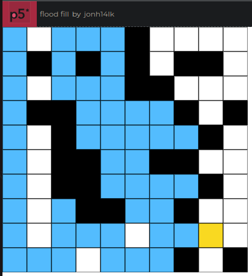
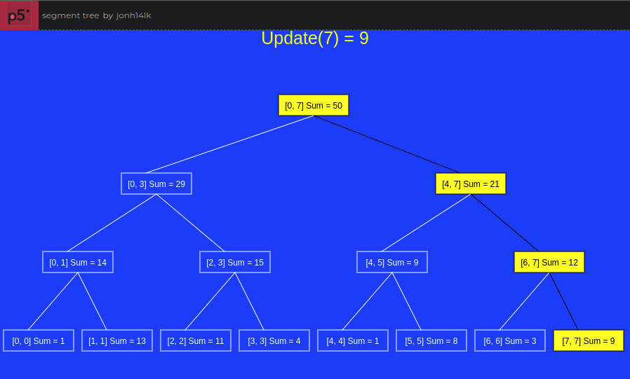
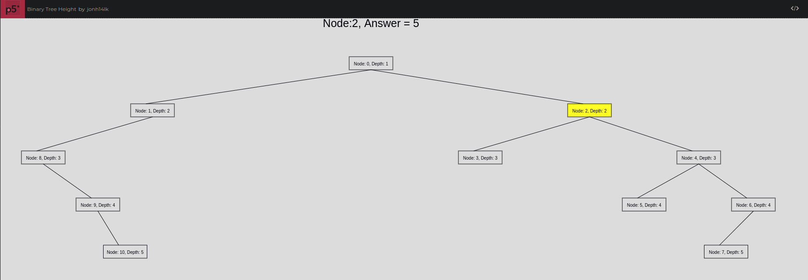
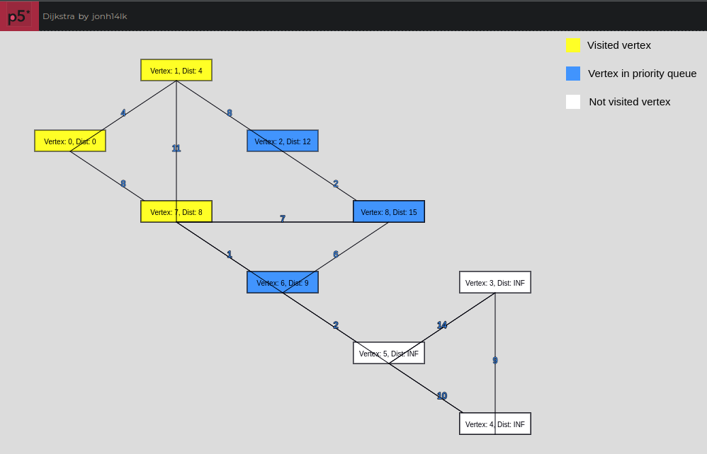

# p5jsSketches

Some sketches made with p5js.

# Sketches:

## [Flood Fill](https://editor.p5js.org/jonh14lk/full/ofn4mZ4f1)

## [Segment Tree (Range Sum Query)](https://editor.p5js.org/jonh14lk/full/PHJUwtVY4)

## [Height of a Binary Tree](https://editor.p5js.org/jonh14lk/full/QTteT6Zpn)

## [Dijkstra](https://editor.p5js.org/jonh14lk/full/glIsGP25U)

